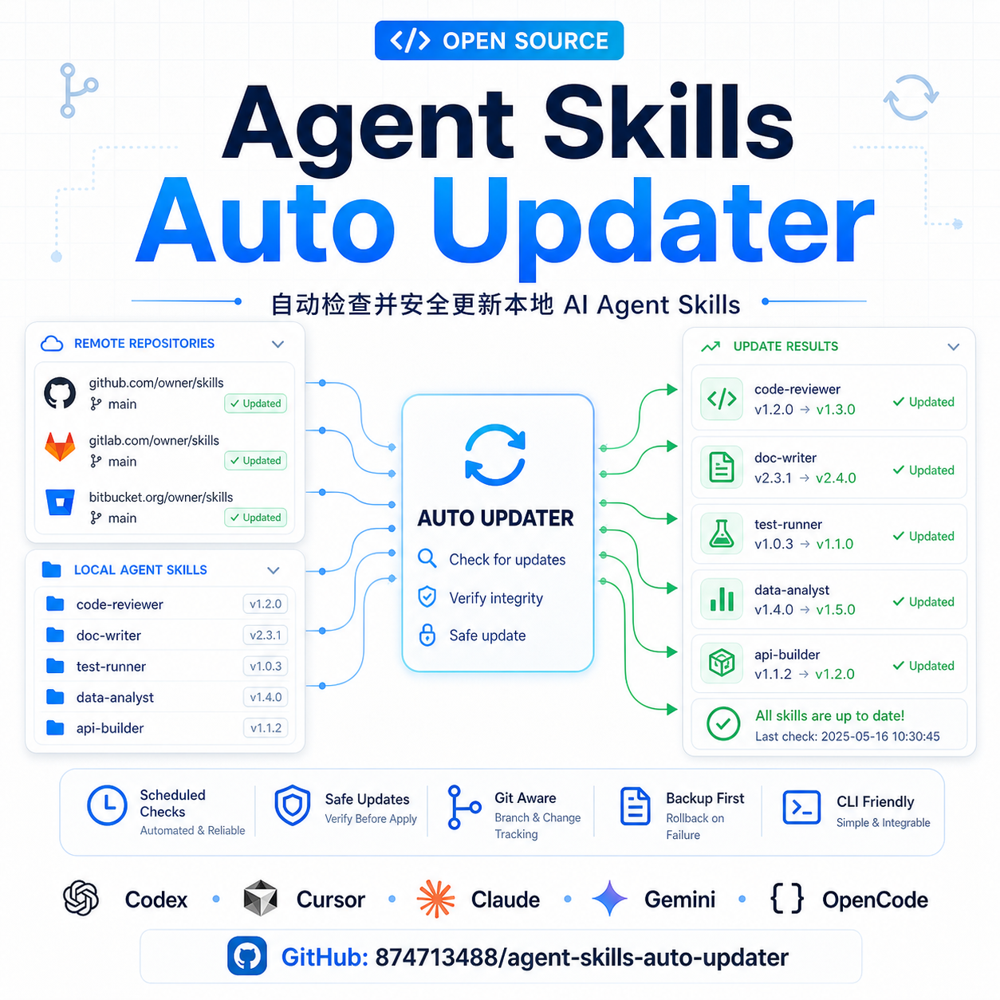

# Agent Skills Auto Updater

<p align="center">
  
</p>

<!-- Easter egg: 事实上你只需要告诉 Codex 之类的 agent：检查并更新一下本地的 skills 即可。 -->

A portable skill and CLI helper for checking and safely updating local AI agent skills that are backed by Git repositories.

It is designed for Codex, but it can also scan common local skill roots for Claude, Cursor, Gemini, OpenCode, and shared skill folders.

## What it does

- Finds local Git-backed skill repositories.
- Runs `git fetch --prune origin`.
- Reports whether each skill is current, behind, skipped, or failed.
- Applies updates only with `git pull --ff-only`.
- Skips dirty worktrees, detached HEADs, ahead branches, and diverged branches.
- Supports an opt-in prompt mode so users can choose whether to update.

It does not overwrite local edits, run `git reset`, rebase, or resolve conflicts automatically.

## Install for Codex

Clone or copy this repository into your Codex skills directory:

```bash
mkdir -p ~/.codex/skills
git clone https://github.com/874713488/agent-skills-auto-updater.git \
  ~/.codex/skills/agent-skills-auto-updater
```

Restart Codex so it can discover the new skill.

## CLI usage

Check for updates without changing files:

```bash
python3 ~/.codex/skills/agent-skills-auto-updater/scripts/agent_skills_auto_updater.py --check
```

Apply safe fast-forward updates:

```bash
python3 ~/.codex/skills/agent-skills-auto-updater/scripts/agent_skills_auto_updater.py --apply
```

Show the roots that would be scanned:

```bash
python3 ~/.codex/skills/agent-skills-auto-updater/scripts/agent_skills_auto_updater.py --list-roots
```

Use JSON output:

```bash
python3 ~/.codex/skills/agent-skills-auto-updater/scripts/agent_skills_auto_updater.py --check --json
```

## Agent roots

By default, the updater scans known local roots that exist:

| Agent | Default roots |
| --- | --- |
| Codex | `~/.codex/skills` |
| Claude | `~/.claude/skills` |
| Cursor | `~/.cursor/skills`, `~/.cursor/skills-cursor` |
| Gemini | `~/.gemini/skills` |
| OpenCode | `~/.config/opencode/skills` |
| Shared | `~/ai-skills` |

Limit scanning to one agent:

```bash
python3 scripts/agent_skills_auto_updater.py --agent codex --check
python3 scripts/agent_skills_auto_updater.py --agent cursor --check
```

Scan a custom root:

```bash
python3 scripts/agent_skills_auto_updater.py --root ~/my-skills --check
```

Include Codex plugin cache:

```bash
python3 scripts/agent_skills_auto_updater.py --agent codex --include-plugin-cache --check
```

## Prompt mode

Prompt mode stores a small config file at:

```text
~/.config/agent-skills-auto-updater/config.json
```

Enable prompt mode:

```bash
python3 scripts/agent_skills_auto_updater.py --enable-auto-prompt
```

Run the prompt:

```bash
python3 scripts/agent_skills_auto_updater.py --prompt
```

Disable future prompts:

```bash
python3 scripts/agent_skills_auto_updater.py --disable-auto-prompt
```

Check prompt status:

```bash
python3 scripts/agent_skills_auto_updater.py --auto-prompt-status
```

## About startup automation

Skills do not run automatically just because Codex or another agent starts.

This repository provides the update logic and the enable/disable prompt state. To ask on every app launch, connect the CLI to an external launcher, shell profile, cron job, launchd job, or the automation system provided by your agent environment.

Do not rely on the skill file alone as a startup hook.

## Example output

```text
status            skill          branch  local      upstream    message
----------------  -------------  ------  -----      --------    -------
update_available  nature-skills  main    85f2b4f    866a63d     behind origin/main

Summary: update_available: 1
```

After `--apply`:

```text
status   skill          branch  local      upstream    message
-------  -------------  ------  -----      --------    -------
updated  nature-skills  main    866a63d    866a63d     85f2b4f -> 866a63d

Summary: updated: 1
```

## Repository layout

```text
agent-skills-auto-updater/
├── SKILL.md
├── agents/
│   └── openai.yaml
├── assets/
│   └── cover.png
└── scripts/
    └── agent_skills_auto_updater.py
```

## License

No license has been declared yet.
